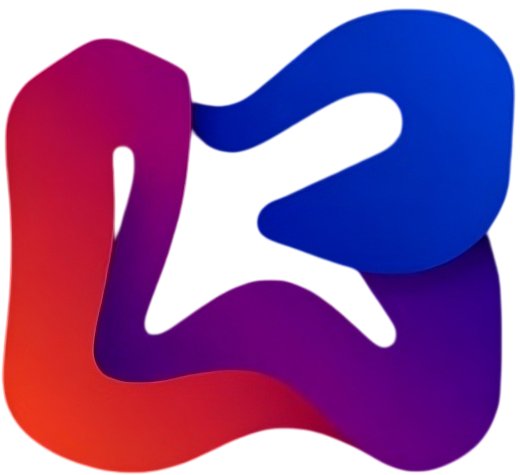

<div align="center">


### Spark Studio 17
**Visual IDE for building PHP desktop applications. Originally DevelNext.**

_*Now available on Linux🐧*_

[]()
[]()
[]()
[]()
</div>

## Overview

<details>
  <summary>Screenshots</summary>
  
  | Screenshots | 
  | :--:  | 
  |  | 
  |  |
  |  |
  
</details>   

Spark Studio is an IDE for creating cross-platform desktop GUI applications in PHP. It bundles the JPHP runtime — a PHP implementation on the Java Virtual Machine — with a visual form designer, code editor, debugger, plugin system, and build toolchain (Launch4J, InnoSetup, Ant, Gradle).

## Features

- Visual form designer with drag-and-drop palette, property editor, event editor, behavior editor
- PHP code editor with syntax highlighting, autocomplete, code navigation
- Project templates (GUI app, PHP library, Gradle, etc.)
- Visual behaviors: animations, effects, game logic
- Debugger with breakpoints and step-through
- Plugin system via extensions and bundles
- Export to JAR with .bat executor
- English and Russian interfaces

## Quick start

```bash
./bin/windows.bat #windows
```

```bash
./bin/linux.sh #linux
```

> [!NOTE]
> The Linux version was tested on:
> 
>    


> [!WARNING]
> Recommend running Spark Studio on Linux with PortProton or Wine, because the project is not natively supported on Linux distributions. If you encounter problems with the tested distributions, create an issue using the template. Requires Java 8+.

> [!NOTE]
> To run Spark Studio natively on Linux:
> 1. Download and install Java from the [official website](https://www.java.com/download/).
> 2. Move the files to the /bin directory and name the folder "__jre__" (The path to java should look like this "__./bin/jre/bin/java__").
> 3. Launch Spark Studio.

> [!WARNING]
> If Spark Studio doesn't launched on linux natively, try to download JFX into the jdk directory or launch with PortProton or Wine.

## Project structure

| Directory | Contents |
|---|---|
| `framework/SparkStudio/` | IDE core application (PHP) |
| `framework/techone-ui/` | TechOne UI design system (web components) |
| `framework/jphp-app-framework/` | JPHP application framework |
| `gui/` | JavaFX GUI extensions, form designer, rich text |
| `runtime/` | JPHP runtime and core (Java) |
| `extensions/` | JSON, XML, ZIP, Zend compat extensions |
| `ide/` | Documentation, platform support, plugin store |
| `languages/` | en / ru language packs |
| `bin/` | Launcher script, JRE, Wayland/X11 grab fix |

## Authors

<table>
  <tr>
    <td align="center">
      <a href="https://github.com/meigoc">
        <br>
        <b>meigoc</b>
      </a>
    </td>
    <td align="center">
      <a href="https://github.com/dim-s">
        <br>
        <b>dim-s</b>
      </a>
    </td>
    <td align="center">
      <a href="https://github.com/SerafimArts">
        <br>
        <b>SerafimArts</b>
      </a>
    </td>
    <td align="center">
      <a href="https://github.com/TsSaltan">
        <br>
        <b>TsSaltan</b>
      </a>
    </td>
  </tr>
  <tr>
    <td align="center">
      <a href="https://github.com/nagayev">
        <br>
        <b>nagayev</b>
      </a>
    </td>
    <td align="center">
      <a href="https://github.com/Ded-Alex">
        <br>
        <b>Ded-Alex</b>
      </a>
    </td>
    <td align="center">
      <a href="https://github.com/ll1ness">
        <br>
        <b>ll1ness</b>
      </a>
    </td>
  </tr>
</table>

## License

MIT © 2026 ll1ness. Other components under their respective licenses.
