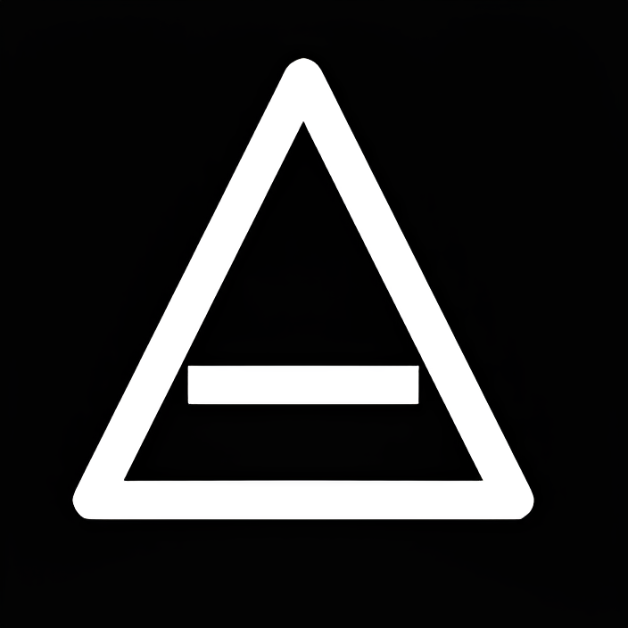

<div align="center">

  
### TechOne UI
_Open-source UI framework. Zero deps._

[](https://github.com/ll1ness/techone-ui)
[](LICENSE)
[]()
[]()
[]()
[](https://github.com/ll1ness/techone-ui)


[Install](#quick-start) · [Docs](vault/overview.md) · [Components](#components) · [GitHub](https://github.com/ll1ness/techone-ui)

</div>

24 UI components. One `.js` file. No build step. No npm install.

## Quick start

```bash
git clone https://github.com/ll1ness/techone-ui.git
cd techone-ui
python3 -m http.server 8080
```

Include in your project:

```html
<link rel="stylesheet" href="styles.css">
<script src="build/techon-ui.min.js"></script>
```

Then use any component:

```html
<button class="to-button" data-variant="primary">Click me</button>
```

## API

All components and systems are accessible via the `toui` namespace:

```js
toui.init()                        // initialize all components
toui.button                        // Button class
toui.accordion                     // Accordion class
toui.dialog                        // Dialog class
toui.Animation                     // animation utilities
toui.Interaction                   // interaction helpers
toui.Management                    // state management
```

## Components

| Category | Components |
|---|---|
| Basic | `button`, `icon-button`, `tag`, `badge`, `avatar` |
| Layout | `card`, `grid`, `flex`, `banner`, `breadcrumbs` |
| Interactive | `accordion`, `dialog`, `dropdown`, `tooltip`, `toggle-button` |
| Status | `spinner`, `skeleton`, `progress`, `status-indicator`, `pulse` |
| Utility | `timeline`, `table`, `scroll-top`, `icon` |

All 24 components are documented in [vault/components.md](vault/components.md).

## Customization

Override CSS variables:

```css
:root {
  --to-primary: #6366f1;
  --to-bg: #0a0a0f;
  --to-text: #ffffff;
}
```

## License

MIT © 2026 [ll1ness](https://github.com/ll1ness)

---

<div align="center">
  <a href="https://github.com/ll1ness/techone-ui">GitHub</a>
  · <a href="https://ll1ness.github.io/techone-ui/">Live Demo</a>
  · <a href="vault/overview.md">Docs</a>
</div>
